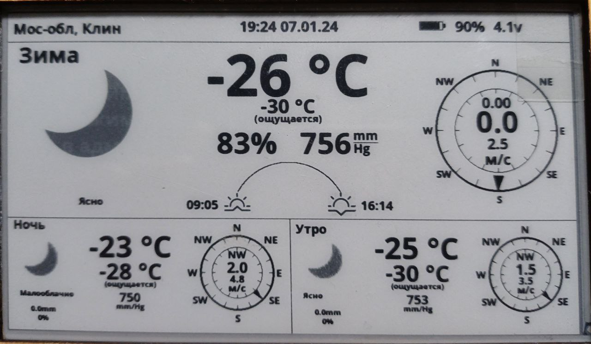

## LILY GO WEATHER DISPLAY 4.7

отображение погоды по регионам, которые задаются из сервера, позволяет зайти на устройство посредством подключение к wifi в веб-интерфейс , где можно настроить 

1. wifi соединение до 5 шт (автоматически подберет сеть)
2. задать ссылку, откуда будет выкачивать список доступных регионов, скачивание ресурсов и получение информации о погоде
3. частота обновлений информации по погоде
4. ссылка на источник обновлений прошивки (возможно будет из гитлаба), ну или же вовсе отключить такую возможность (пока нет такого функционала) 
5. режим полной очистки или очищать локально фрагменты на экране, куда потом будет доставлена свежая информация

во время поиска wifi подключения можно будет нажать любую кнопку , которая остановит поиск wifi и начнет показывать экран с qr кодом подключения к веб-интерфейсу, а оттуда уже при кнопке сохранить будет сбрасывать приложение и заново будет идти поиск

после того , когда найдет wifi сеть и подключится прибор будет запрашивать информацю о прошивке, в случе, если прошивка будет старая - она спросит (можно ли мне обновиться) , да или нет , если да, то идет обновление прошившки и перезагрузка.

Команда для компиляции прошивки:
>arduino-cli compile --fqbn esp32:esp32:esp32:JTAGAdapter=default,PSRAM=enabled,PartitionScheme=default,CPUFreq=240,FlashMode=qio,FlashFreq=80,FlashSize=4M,UploadSpeed=921600,LoopCore=1,EventsCore=1,DebugLevel=none,EraseFlash=none .\lilygo-weather-display-4-7.ino --output-dir ./firmware

Команда для конвертации изображений в формат uint8:
>python converter.py -i image.PNG -n image -o image.h